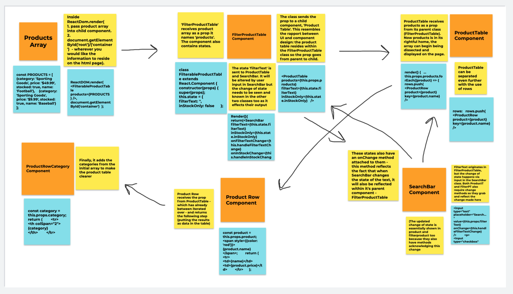
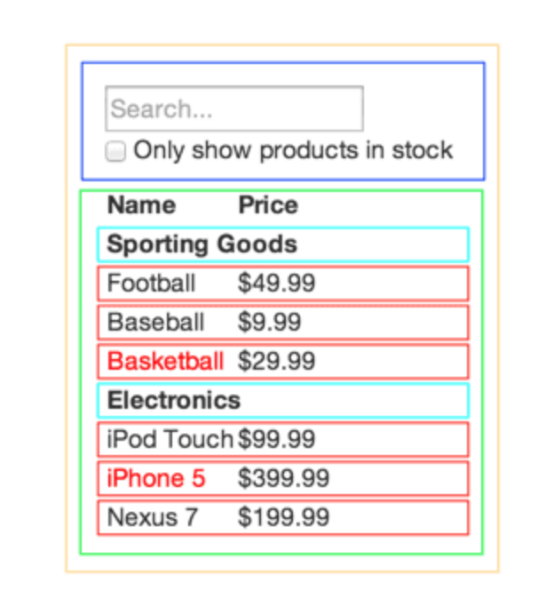

# product_search

### Props relationship Diagram ###

Apologies if this is a bit messy, but the crossover between different classes really helped me understand and appreciate the different interactions between components!

### Intent ###

In this project, I simply wanted to have a deeper understanding of the nature between props and states in React. By delving into this 'Product Search' code, I was also able to guage the context of parent/child component relationships and how they interlink where parameters are involved. 

Interestingly, the nature of components is often reflected or even dependent on the UI design of the product. This is considered 'breaking the UI into A Component Hierarchy' from the React website. 

Here I found a really useful and informative diagram explaining this: 

It also really reflects the single responsibilty principle, whereby every component only really has one main purpose. 

Please see index.js to reference the code used for the diagram. I intend to use this similar component-relationship to make a To-Do list in React. 

